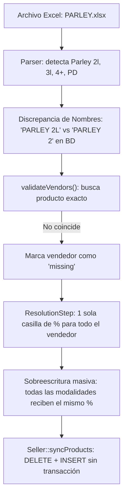
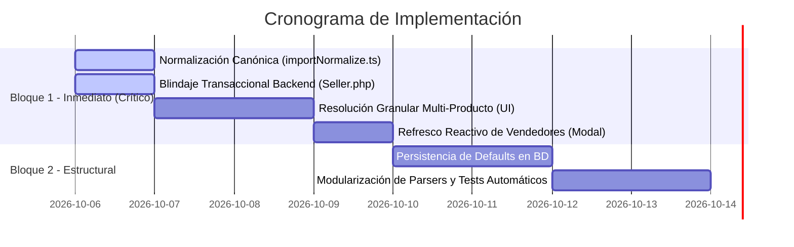

# Plan Maestro: Normalización Granular Multi-Producto y Persistencia Definitiva de Porcentajes

## 1. Resumen Ejecutivo y Contexto de Negocio

En la operativa de banca de apuestas deportivas, el producto **PARLEY** no es una entidad uniforme: se desglosa en distintas modalidades según la cantidad de selecciones o logros por jugada:
- **PARLEY 2** (2 logros)
- **PARLEY 3** (3 logros)
- **PARLEY 4+** (4 o más logros)
- **PARLEY PD** (Premio Directo / Derecho)

Cada una de estas modalidades maneja **porcentajes de comisión para el vendedor y porcentajes de participación bancaria completamente distintos** debido a sus probabilidades y márgenes matemáticos de riesgo.

### El Problema Detectado
Actualmente, cada vez que se actualiza el importador o se procesa un archivo nuevo (como `PARLEY.xlsx` o `PARLEY INMEJORABLE.csv`):
1. Los porcentajes guardados en la base de datos se pierden de vista y el importador vuelve a pedir la configuración en `0%`.
2. El modal de resolución colapsa todas las modalidades en un único porcentaje por vendedor, forzando a que `PARLEY 4+` y `PARLEY 2` compartan el mismo valor o se sobreescriban entre sí.
3. Pequeñas variaciones de formato (`Parley 2l` vs `PARLEY 2`, o `PESOS COLOMBIANOS` vs `PESO COLOMBIANA`) rompen las comparaciones estrictas de texto en JavaScript.
4. El backend (`Seller.php`) ejecuta `DELETE FROM products` sin transacción PDO, lo que genera riesgo de pérdida total de datos ante errores de red o llamadas concurrentes.

---

## 2. Diagnóstico Técnico y Evidencia en Código



| Componente | Línea de Código | Falla Encontrada | Consecuencia |
| :--- | :--- | :--- | :--- |
| `parsers.ts` | `242` | Genera `PARLEY ` + `match[1]` crudo (`PARLEY 2L`, `PARLEY 3L`). | No coincide con nombres sin 'L' (`PARLEY 2`, `PARLEY 3`) guardados en BD. |
| `ResolutionStep.tsx` | `153-186` | La interfaz solo pide `commissionPct` y `partPct` a nivel de vendedor. | No permite configurar porcentajes distintos para Parley 2, 3, 4+ y PD. |
| `SalesImportModal.tsx` | `326-332` | Inicializa ciegamente `commissionPct: 0` y `partPct: 0`. | Obliga a reescribir datos en lugar de sugerir la plantilla por defecto. |
| `SalesImportModal.tsx` | `71-89` | `allSellers` se lee una vez y no se refresca tras importar ni en "Nueva Carga". | Los vendedores recién creados no se encuentran en la siguiente importación. |
| `SalesImportModal.tsx` | `569` | `api.updateSeller` se llama dentro del bucle de cada fila (`activeSession.rows`). | Bucle N+1 destructivo que borra y reinserta productos en MySQL fila por fila. |
| `Seller.php` | `133-155` | `DELETE FROM products WHERE seller_id = ?` sin transacción PDO. | Si la conexión se interrumpe, el vendedor pierde todos sus productos y porcentajes. |

---

## 3. Arquitectura Objetivo (Target Design)

### 3.1. Nombres Canónicos Estandarizados
Se crea un módulo centralizado `src/utils/importNormalize.ts` que elimina cualquier ambigüedad:

* **Modalidades de Parley:**
  * `Parley 2l`, `PARLEY 2L`, `Parley 2` $\rightarrow$ **`PARLEY 2`**
  * `Parley 3l`, `PARLEY 3L`, `Parley 3` $\rightarrow$ **`PARLEY 3`**
  * `Parley 4+`, `PARLEY 4+`, `Parley 4` $\rightarrow$ **`PARLEY 4+`**
  * `Parley PD`, `Parley pd`, `Derecho`, `Ventas por Derecho` $\rightarrow$ **`PARLEY PD`**
* **Monedas Canónicas:**
  * `DOLAR`, `$`, `USD` $\rightarrow$ **`DOLAR`**
  * `BOLIVAR`, `BOLIVARES`, `VES`, `BS` $\rightarrow$ **`BOLIVARES VENEZOLANOS`**
  * `COP`, `PESO`, `PESOS`, `PESOS COLOMBIANOS`, `PESO COLOMBIANA` $\rightarrow$ **`PESO COLOMBIANA`**

### 3.2. Matriz de Plantillas por Defecto (Defaults)
Si un vendedor nuevo o existente no tiene configurada alguna de estas modalidades en la base de datos, el sistema no propone `0%` ni copia ciegamente de otro juego; sugiere la plantilla base del producto:

```typescript
export const DEFAULT_PRODUCT_PERCENTAGES: Record<string, { commissionPct: number; partPct: number }> = {
    'PARLEY 2':  { commissionPct: 12, partPct: 10 },
    'PARLEY 3':  { commissionPct: 14, partPct: 10 },
    'PARLEY 4+': { commissionPct: 10, partPct: 10 },
    'PARLEY PD': { commissionPct: 15, partPct: 10 },
    'LOTERIAS':  { commissionPct: 10, partPct: 0  },
    'ANIMALITOS':{ commissionPct: 10, partPct: 0  },
    'AMERICANAS':{ commissionPct: 10, partPct: 10 },
};
```

### 3.3. Estructura de Resolución Multi-Producto en UI
En lugar de una sola casilla por vendedor, `ResolutionStep.tsx` representará la estructura jerárquica real:

```text
┌────────────────────────────────────────────────────────────────────────┐
│ 👤 VENDEDOR / GRUPO: 1DONLUCHO                                         │
│ ┌────────────────────────────────────────────────────────────────────┐ │
│ │ 🏀 PARLEY 2  (USD)  -> [ 12 ]% Venta  [ 10 ]% Part   (Sugerido)    │ │
│ │ 🏀 PARLEY 3  (USD)  -> [ 14 ]% Venta  [ 10 ]% Part   (Sugerido)    │ │
│ │ 🏀 PARLEY 4+ (USD)  -> [ 10 ]% Venta  [ 10 ]% Part   (Guardado BD) │ │
│ │ 🏀 PARLEY PD (USD)  -> [ 15 ]% Venta  [ 10 ]% Part   (Sugerido)    │ │
│ └────────────────────────────────────────────────────────────────────┘ │
└────────────────────────────────────────────────────────────────────────┘
```

---

## 4. Plan de Implementación por Fases



### Fase 1: Capa de Normalización Canónica
* **Archivo a crear:** `lyberate-frontend/src/utils/importNormalize.ts`
* **Funciones:**
  * `normalizeProductName(raw: string): string` (resuelve `Parley 2l` $\rightarrow$ `PARLEY 2`, etc.)
  * `normalizeCurrencyName(raw: string): string` (resuelve `PESOS COLOMBIANOS` $\rightarrow$ `PESO COLOMBIANA`, etc.)
  * `normalizeSellerName(raw: string): string` (espacios y mayúsculas)
  * `buildConfigKey(seller: string, product: string, currency: string): string`
* **Impacto:** Cero discrepancias por mayúsculas, tildes, sufijos "L" o espacios.

### Fase 2: Blindaje del Backend con Transacciones ACID
* **Archivo a modificar:** `lyberate-backend/models/Seller.php`
* **Acciones:**
  * Envolver `update()` y `syncProducts()` dentro de `$db->beginTransaction()`, `$db->commit()` y `$db->rollBack()`.
  * Evitar llamadas duplicadas o fallas parciales que borren la lista de productos del vendedor.

### Fase 3: Resolución Granular en Frontend (Multi-Producto por Vendedor)
* **Archivos a modificar:**
  * `lyberate-frontend/src/components/SalesImport/types.ts`
  * `lyberate-frontend/src/components/SalesImport/ResolutionStep.tsx`
  * `lyberate-frontend/src/components/SalesImportModal.tsx`
* **Acciones:**
  * Cambiar el tipo de `VendorConfig` para que incluya `products: { productName: string; currency: string; commissionPct: number; partPct: number; }[]`.
  * La pantalla de resolución renderiza inputs independientes para cada modalidad faltante de ese vendedor.
  * Precargar los inputs con la plantilla de defaults o con el valor que el vendedor ya tenga en base de datos.

### Fase 4: Optimización de Rendimiento y Ciclo de Vida Reactivo
* **Archivo a modificar:** `lyberate-frontend/src/components/SalesImportModal.tsx`
* **Acciones:**
  * Crear `refreshCatalogs()`: invocado al montar el modal, inmediatamente después de `executeImport`, y al pulsar *"Nueva Carga"*.
  * Eliminar la llamada a `api.updateSeller` dentro del loop `for (const row of activeSession.rows)`: consolidar los productos nuevos de cada vendedor **antes** de procesar las ventas en lote.

### Fase 5: Pruebas de Regresión con Archivos Reales
* Ejecutar scripts de validación con los archivos de muestra del repositorio:
  * `PARLEY.xlsx` (verifica las 4 modalidades: 2, 3, 4+, PD)
  * `PARLEY INMEJORABLE.csv`
  * `BETM3.xlsx`
  * `AMERICANAS $.xlsx`
  * `Report-$.xls`

---

## 5. Criterios de Aceptación (Definition of Done)

1. **Independencia de Porcentajes:** Se puede asignar 12% a `PARLEY 2`, 14% a `PARLEY 3`, 10% a `PARLEY 4+` y 15% a `PARLEY PD` para un mismo vendedor.
2. **Cero Reseteos en Cargas Futuras:** Al importar nuevamente `PARLEY.xlsx` (o tras hacer clic en "Nueva Carga"), el sistema reconoce automáticamente todas las modalidades y sus porcentajes guardados sin volver a pedir confirmación.
3. **Integridad en BD:** Ningún vendedor pierde productos existentes al importar un archivo que solo contenga un subconjunto de sus juegos.
4. **Cero Errores de Moneda:** `PESOS COLOMBIANOS` y `PESO COLOMBIANA` se unifican sin crear monedas huérfanas.